# 云原生图数据库解谜、容器化实践与 Serverless 应用实操
Graph DB on K8s Demystified and its Serverless applicaiton in actions.

<div class="uppercase text-sm tracking-widest">
古思为
<p class="w-71 opacity-80">Developer Advocate @
</p>
</div>

<div class="uppercase text-sm tracking-widest">
方阗
<p class="w-47 opacity-80">Maintainer of
</p>
</div>

<div class="abs-bl mx-14 my-12 flex">
  
  <div class="ml-3 flex flex-col text-left">
    <div><b>KCD China</b> 2021</div>
    <div class="text-sm opacity-50">Dec. 16th @Shanghai</div>
  </div>
</div>


---
layout: 'intro'
---

# 古思为

<div class="leading-8 opacity-80">

- Nebula Graph 开发者布道师<br>
- 程序员<br>
- 开源信徒<br>
</div>

<div class="my-10 grid grid-cols-[40px,1fr] w-min gap-y-4">
  <ri-github-line class="opacity-75"/>
  <div><a href="https://github.com/wey-gu" target="_blank">wey-gu</a></div>
  <ri-twitter-line class="opacity-75"/>
  <div><a href="https://twitter.com/wey_gu" target="_blank">wey_gu</a></div>
  <ri-user-3-line class="opacity-75"/>
  <div><a href="https://siwei.io" target="_blank">siwei.io</a></div>
</div>


<div class="abs-tr mr-8 mt-70 flex opacity-55">
  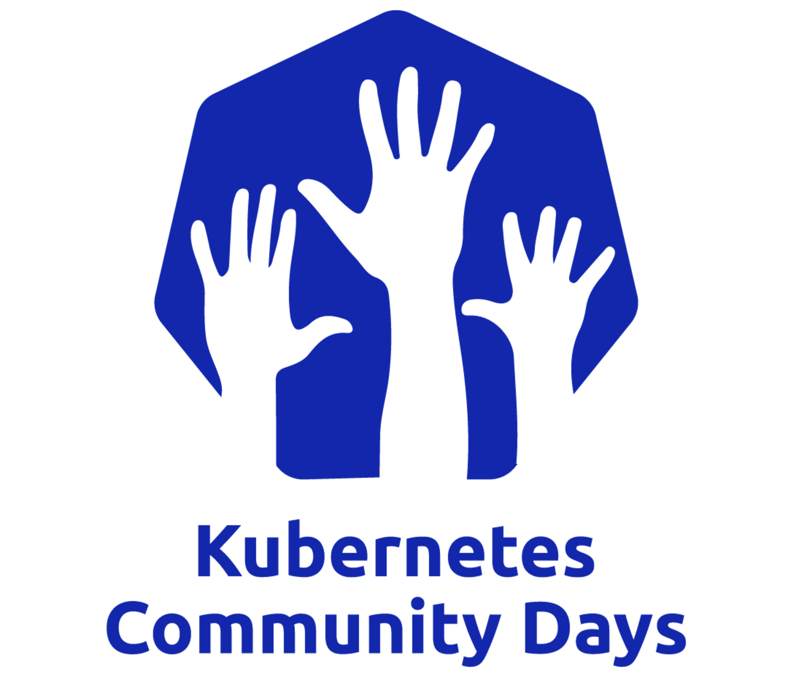
</div>

---
layout: 'intro'
---

# 方阗

<div class="leading-8 opacity-80">

- OpenFunction 社区 Maintainer<br>
- 青云科技研发工程师<br>
</div>

<div class="my-10 grid grid-cols-[40px,1fr] w-min gap-y-4">
  <ri-github-line class="opacity-75"/>
  <div><a href="https://github.com/tpiperatgod" target="_blank">tpiperatgod</a></div>
  <!-- <ri-twitter-line class="opacity-75"/>
  <div><a href="https://twitter.com/wey_gu" target="_blank">wey_gu</a></div> -->
  <ri-user-3-line class="opacity-75"/>
  <div><a href="https://www.laminar.fun/" target="_blank">laminar.fun</a></div>
</div>


<div class="abs-tr mr-8 mt-70 flex opacity-55">
  
</div>

---
layout: section
---

# Serverless 简介

什么是 Serverless ？ Serverless / FaaS 领域开源现状如何？ Serverless 的新愿景？

---
layout: center
class: text-center
---

# 什么是 Serverless ？

<div class="abs-tl mx-12 my-6 flex">
  
</div>

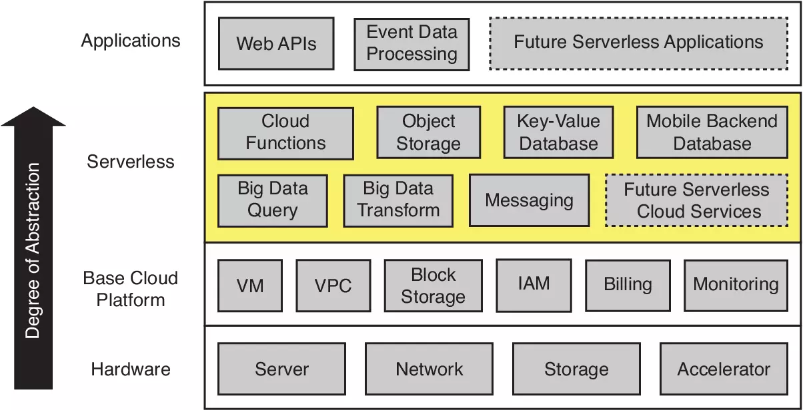

---
layout: quote
---

# Serverless / FaaS 领域开源项目现状

<div class="abs-tl mx-12 my-6 flex">
  
</div>

```shell {1|2-5|6-8}
现有开源 FaaS 项目: 绝大多数启动较早，大部分都在 Knative 出现前就已经存在了

Knative: 非常杰出的 Serverless 平台，Knative Serving 仅仅能运行应用，不能运行函数，还不能称之为 FaaS 平台
Knative Eventing: 非常优秀的事件管理框架，但设计有些过于复杂，用户用起来有一定门槛
OpenFaaS: 比较流行的 FaaS 项目，但是技术栈有点老旧，依赖于 Prometheus 和 Alertmanager 进行 Autoscaling，也并非最专业和敏捷的做法

近年来云原生 Serverless 相关领域陆续涌现出了很多优秀的开源项目：
KEDA、Dapr、Cloud Native Buildpacks（CNB）、Tekton、Shipwright
```

---
layout: quote
---

# Serverless 新愿景

新一代开源函数计算平台 - 契机

<div class="abs-tl mx-12 my-6 flex">
  
</div>

```shell {1|2-6|7}
现有开源 Serverless 或 FaaS 平台并不能满足构建现代云原生 FaaS 平台的要求

- 开放的云原生框架
- 涌现的优秀项目
- 日新月异的业务模式

云原生 Serverless 领域的最新进展为构建新一代 FaaS 平台提供了可能
```

---
layout: two-cols
---

# Function Lifecycle

新一代开源函数计算平台 - 契机

::right::

<v-clicks>
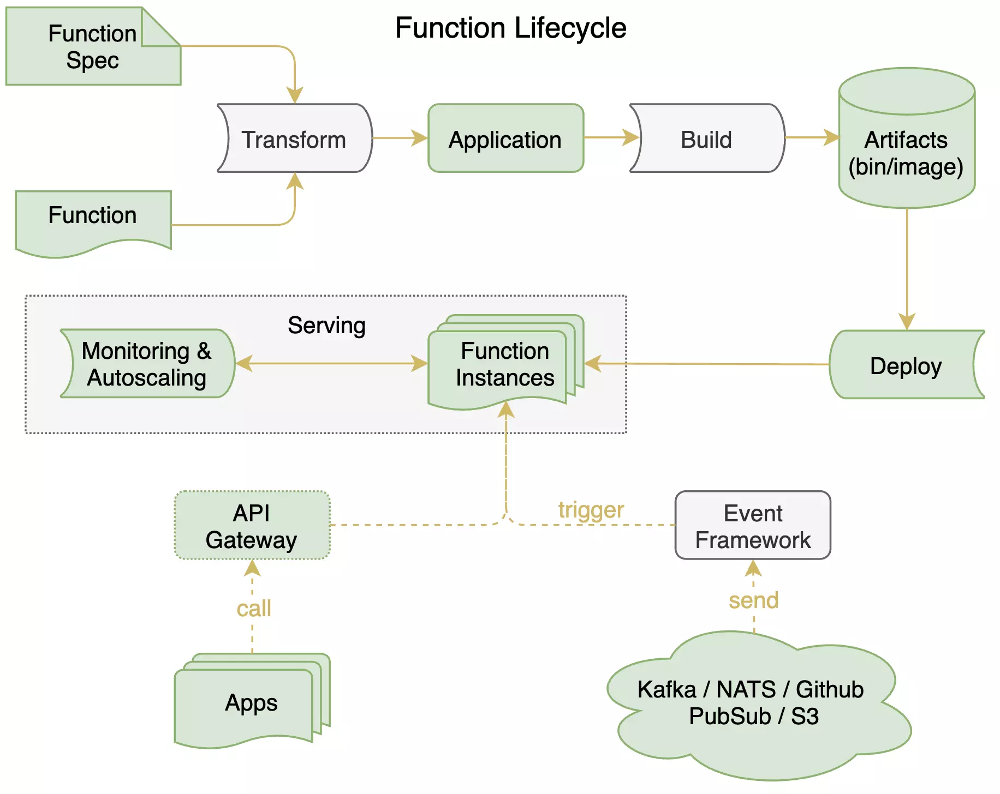
</v-clicks>

<div class="abs-bl mx-12 my-6 flex">
  
</div>

---
layout: default
---
# Function Framework
<div class="grid grid-cols-[300px,600px] gap-4">
<div>

```go
package userfunction

import (
    "fmt"
    "net/http"
)

// HelloWorld writes "Hello, World!" to the HTTP response.
func HelloWorld(w http.ResponseWriter, r *http.Request) {
    fmt.Fprint(w, "Hello, World!\n")
}
```

&emsp;&emsp;&emsp; 用户函数示例 ▲

&emsp;&emsp;&emsp; 函数注册机制 ▶

 </div>
 
 <div>

```go {3-6,16-20|8-14}
package main

import (
	...
	userfunction "{{.Package}}"
)

func register(fn interface{}) error {
	...
	if fnHTTP, ok := fn.(func(http.ResponseWriter, *http.Request)); ok {
		if err := functionframeworks.RegisterHTTPFunction(ctx, fnHTTP); err != nil {...}
	}
	...
}

func main() {
	if err := register(userfunction.{{.Target}}); err != nil {
		log.Fatalf("Failed to register: %v\n", err)
	}
}
```
  </div>
  </div>


<div class="abs-bl mx-12 my-6 flex">
  
</div>

---
layout: quote
---

# Function Build

<v-clicks :every='1'>

```shell {1|3|5|7}
K8s 弃用 Docker 作为 Container Runtime

不能再以 Docker in docker 的方式以 Docker build 构建镜像

还有什么选择？

如何管理 Build pipeline？
```
</v-clicks>
<br>

<div v-click="5">

## 用 Tekton 管理镜像制作流水线
</div>

<br>

<div v-click="6">

1. 获取源代码
2. 制作镜像
3. 上传镜像
</div>

<div class="abs-br mx-12 my-6 flex">
  
</div>

---
layout: default
---

# Function Build

> 如何在这些工具直接进行选择和切换？

<br>

<div class="grid grid-cols-[250px,300px,300px] gap-4">
  <div v-click="1">
  <br><br>

  - Cloud Native Buildpacks
  - buildah
  - buildkit
  - kaniko
  </div>

  <div v-click="2">
  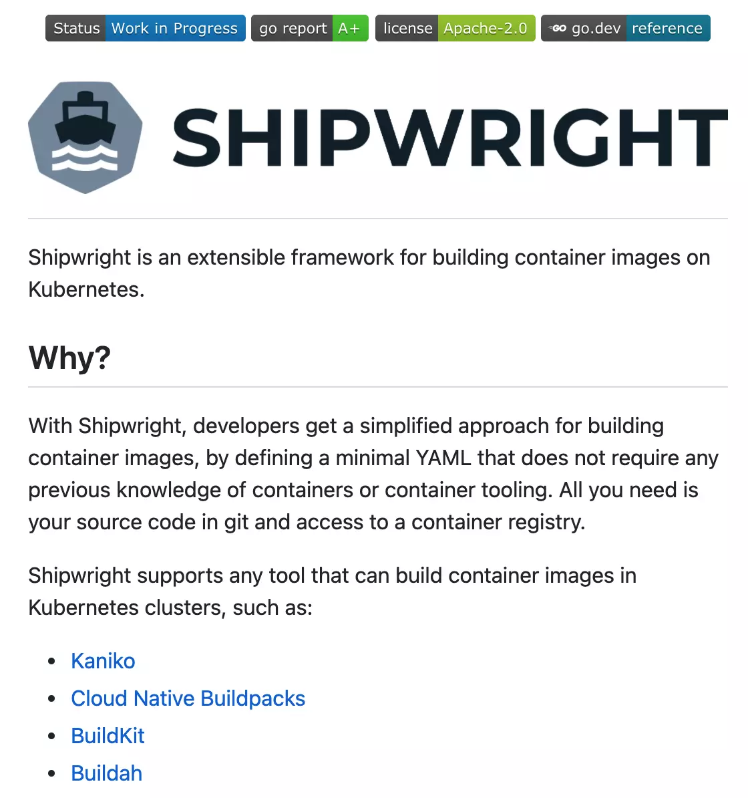
  </div>

  <div v-click="3">
  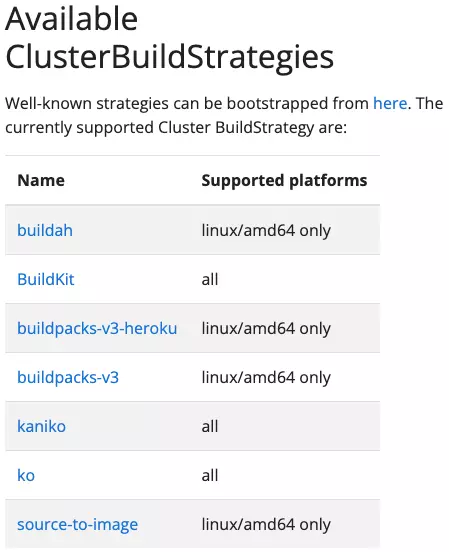
  </div>
</div>
<br>

<div class="abs-bl mx-12 my-6 flex">
  
</div>
---
layout: default
---

# Function Serving

4 种函数调用类型（CNCF Serverless 白皮书）

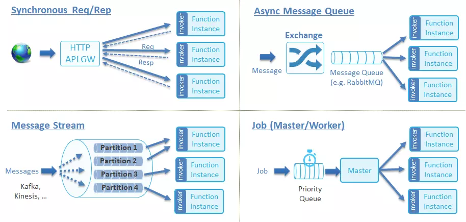

<div class="abs-tr mx-12 my-6 flex">
  
</div>
---
layout: two-cols
---

# Function Serving

<div v-click="1">

同步函数: HTTP / blocking / Req & Resp
</div>

<div v-click="2">

运行时：
  - Knative Serving
  - KEDA + KEDA http-add-on(Beta) + Deployment
</div>
<br><br>

<div v-click="3">

异步函数: Event driven
</div>

<div v-click="4">

运行时：
  - KEDA + Deployment / Job
  - Dapr
</div>

::right::

<div v-click="2">
  
  
</div>
<div v-click="4">
  
  
</div>

<div class="abs-br mx-12 my-6 flex">
  
</div>
---
layout: default
---

# Function Serving - Dapr

- Function Without Dapr

5 种语言 x 10 个 Message Queue = 50 种实现

- Function With Dapr

5 种语言 x 1 个抽象 Message Queue (用 1 种方式即 HTTP/GRPC 对接 10 个 MQ) = 5 种实现

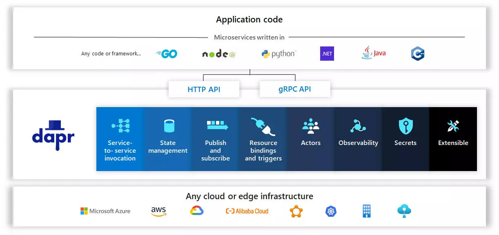

<div class="abs-tr mx-12 my-6 flex">
  
</div>

---
layout: section
---

# OpenFunction
新一代开源函数计算平台

---
layout: default
---

# OpenFunction 架构图

<v-clicks>

## ➤ core.openfunction.io

Functions | Servings | Builders

## ➤ events.openfunction.io

EventSources | Triggers | EventBus(ClusterEventBus)

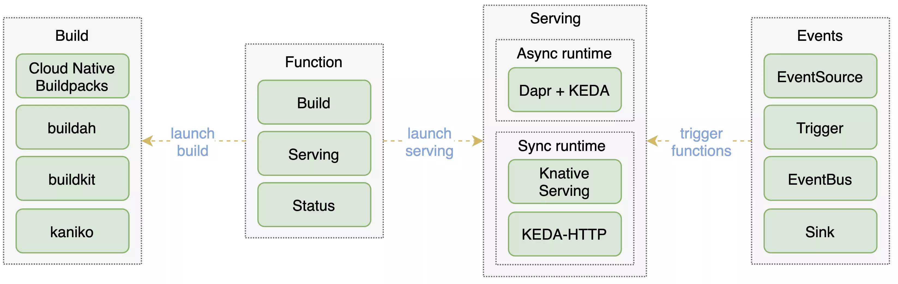
</v-clicks>

<div class="abs-tr mx-12 my-6 flex">
  
</div>


---
layout: section
---

# OpenFunction 案例

OpenFunction 有哪些应用场景？OpenFunction 还能做什么？

---
layout: default
---

# 事件管理框架

<v-clicks>

>本质上来看，事件框架也是一个由事件驱动的工作负载，那么它本身可以是 Serverless 形式的工作负载吗？
>
>可以用 OpenFunction 的异步函数来驱动吗？

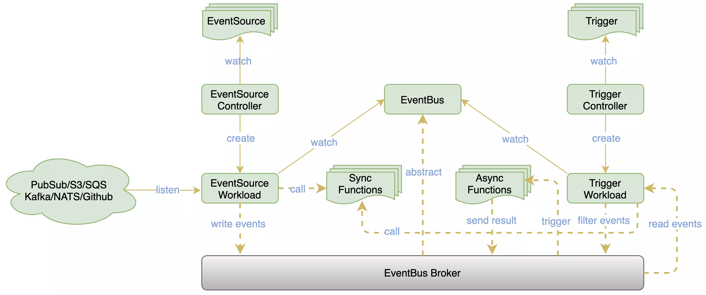
</v-clicks>

<div class="abs-tr mx-12 my-6 flex">
  
</div>

---
layout: default
---

# 自定义日志告警

<v-clicks>

>以 Serverless 的方式用 OpenFunction 异步函数实现日志告警

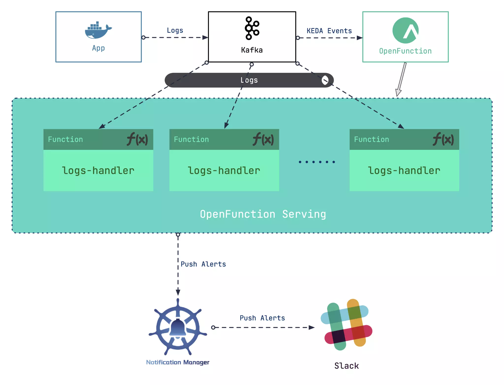
</v-clicks>

<div class="abs-tr mx-12 my-6 flex">
  
</div>

---
layout: section
---

# OpenFunction 社区

交流、参与、演进

---
layout: default
---

# OpenFunction Roadmap

<v-clicks>
  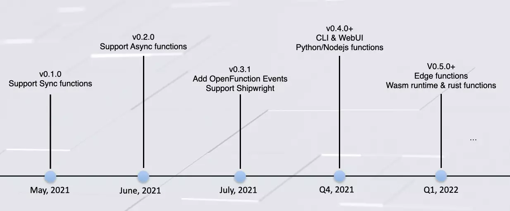
</v-clicks>

<div class="abs-tr mx-12 my-6 flex">
  
</div>

---
layout: default
class: text-center
---

# OpenFunction Community

 

→ https://github.com/OpenFunction

<br>

## 主要仓库
→ https://github.com/OpenFunction/OpenFunction

→ https://github.com/OpenFunction/functions-framework

→ https://github.com/OpenFunction/builder

→ https://github.com/OpenFunction/samples

<div class="abs-tr mx-12 my-6 flex">
  
</div>


---
layout: section
---

# 图数据库简介

什么是图？ 什么是图数据库？ 为什么我们需要一个专门的数据库？

---
layout: image
image: images/what_is_graph.webp
class: text-center
---

# 什么是图？

<div class="abs-tl mx-12 my-6 flex">
  
</div>

<!--
从什么是图说起
- 七桥问题，是欧洲一个城市，两条河中间连个岛屿
- 七条桥，如何能不重复走过这些桥，遍历所有陆地呢？（不能）

这个问题抽象到没有不需要的条件情况下就是左边这样的，只有点和线，这是一个图论里的问题，引出图的定义：

图是一种用来描述实体与实体之间的关系/作用的通用语言
-->

---
layout: quote
---

# "以图结构、图语义来用点、边、属性来查询、表示存储数据的数据库

什么是图数据库

[wikipedia.org/wiki/graph_database](https://wikipedia.org/wiki/graph_database)

了解更多关于 [什么是图数据库](https://nebula-graph.com.cn/about/)

<div class="abs-tl mx-12 my-6 flex">
  
</div>

---
class: text-center
---

# 为什么需要图数据库？

<div class="grid grid-cols-[120px,180px,360px] gap-x-4">

<div />

### 传统数据库

### 图数据库

<v-clicks :every='3'>

<div class="my-auto leading-6 text-base opacity-75">
图模型的结构
</div>

<div >
  
</div>

<div >
  
</div>


<div class="my-auto leading-6 text-base opacity-75">
图语义的查询
</div>

<div >
  
</div>

<div >
  
</div>

<div class="my-auto leading-6 text-base opacity-75">
性能
</div>

<br>

<div >
  
</div>

</v-clicks>

</div>

<div class="abs-br mx-12 my-6 flex">
  
</div>

<!--
- 首先是属性图多变的面向关联关系的结构，使得它天然地不适合存储在二维的表结构中，将一些关系抽离出来的时候，只关注关系，而不是创建表 schema 结构。
- 其次是，对于图语义查询来说，非原生的情况很难，或者很拧巴来表达一个请求
- 最重要的，按照图原生的方式存储的数据才能满足图查询的性能要求
-->

---
layout: section
---

# Nebula Graph!

如何发音：[ˈnebjələ]， 它有哪些特点？

<!--
MCU 电影宇宙

知识图谱！
-->

---

# Nebula Graph 介绍

一个可靠的分布式、线性扩容、性能高效的图数据库<br>
世界上唯一能够容纳千亿顶点和万亿条边，并提供毫秒级查询延时的图数据库解决方案

<div class="grid grid-cols-[300px,300px] gap-17 pt-4 -mb-6">

<v-clicks :every='1'>
<div >
  
</div>

<div >
  
</div>
</v-clicks>
</div>

<v-clicks :every='1'>

<div class="grid grid-cols-[300px,300px]">

> 了解更多 >>>
>
> 文档：[Nebula 架构](https://docs.nebula-graph.com.cn/2.5.0/1.introduction/3.nebula-graph-architecture/1.architecture-overview/)
>
> 官网：[用户案例](https://nebula-graph.com.cn/cases/)
</div>

</v-clicks>

<div class="abs-br mx-12 my-6 flex">
  
</div>

<!--
Separated: Computing L and Stor. L

Computation: 
- Stateless
- Integrated with other computation platforms at the same time.

Stor.:
- Raft (replica number configurable)
- share nothing design -> linear scalability for high throughput and huge data volume

Scaled independently on demand -->

---
layout: section
---

# 云原生时代的图数据库

<!--
Nebula Graph 是面向分布式架构设计的，是天然亲和云原生环境的
-->

<div class="abs-tl mx-12 my-6 flex">
  
</div>

---

# 容器化部署演进

<div class="grid grid-cols-[180px,125px,420px] gap-17 pt-4 -mb-6 text-center">

  <div v-click>

### Nebula Docker

  </div>
  <div v-click>

### Nebula K8s
  </div>
  <div v-click>

### Nebula Operator

  </div>

  <div v-click="1">
    
  </div>

  <div v-click="2">
    
  </div>

  <div v-click="3">
    
  </div>

</div>

<div class="abs-bl mx-12 my-6 flex">
  
</div>

<!--
在早期项目刚发布的时候，nebula 社区还没有 K8s 的开发者
- 我们最早的容器化部署使用了方便的 docker-compose/swarm，从 ci/dev 到生产环境都有
- 后来，我们写了简单的 helm chart 的分发方式
- 终于，今年，我们有了 operator，现在的 2.x 版本是从早期的纯手写的方式切到了 kubebuilder
-->

---

# Nebula Operator 实现

<div class="grid grid-cols-[205px,315px,1fr] gap-4 pt-4 -mb-6">

  <div>

### Kubebuilder Scaffold

```bash {all|1-4,8-9|7,11|13|6,12|1-4,7-9,11,13}
.
├── apis
..
│   └── apps
├── cmd
│   ├── ngctl
│   └── controller-manager
├── config
│   └── crd
├── pkg
│   ├── controller
│   ├── ngctl
│   ├── nebula
│   └── scheduler
├── hack
├── doc
└── tests
    └── e2e
```
  </div>

  <div v-click="1">

### CRD

```yaml {2|16}
apiVersion: apps.nebula-graph.io/v1alpha1
kind: NebulaCluster
metadata:
  name: nebula
spec:
  graphd:
    resources:
      requests:
        cpu: "500m"
        memory: "500Mi"
    replicas: 3
    image: vesoft/nebula-graphd
    version: v2.5.0
...
  reference:
    name: statefulsets.apps.kruise.io
    version: v1
  schedulerName: default-scheduler
```
  </div>

  <div>

  <div v-click="2">

### Control Loop

```python {1,7}
while True
    actual_state = get_state(context)
    expected_state = get_expected(context)
    if actual_state == expected_state:
        continue
    else:
        reconcile(context)
 
```
  </div>

  <div v-click="3">

### Calling Nebula Cluster

```go {2,5,9}
func (s *storUpd) updPhase(mc nebula.MI) {
	if err := mc.Balance(); err != nil {
		return err
	}
	hostItem, err := mc.ListHosts()
	if err != nil {
		return err
	}
	if !mc.IsBalanced(hostItem) {
		if err := mc.Balance(); err != nil {
			return err
```
  </div>

  </div>

</div>


<div class="abs-bl mx-14 my-8 flex">
  <clarity:info-circle-line class="opacity-70"/>
  <div class="ml-3 flex flex-col text-left opacity-70">
    <div><a href="https://github.com/vesoft-inc/nebula-operator" target="_blank">vesoft-inc/<b>nebula-operator</b> </a></div>
  </div>
</div>

<!--
使用 kubebuilder 的话，工程上是很容易实现 operator 的
- 有了它生成的架子之后，只需要关注 operator 业务代码，首先是 CRD
  - 在 api 里去定义 CRD 的 scheme，绑定的 resource
  - 目前我们只有一个 CRD 叫做 NebulaCluster 就是字面的一个N集群
- 其次是 reconsiler
  - 我们知道 control loop 本质上就是如这个伪代码所示，去一直
  - 读取期待的状态与实际的状态，当有不一致的时候，调用 reconcile
  - 去调谐，这部分是主要的业务逻辑
- 值得注意的是，典型的 reconcile 是不只关心 k8s resource 的
- 往往还会去按需去读写应用（Nebula）本身的状态
- 这个例子就是更新的时候，如果涉及 storaged 的重启，它会去对之中的
- 数据分片的分布做 rebalance
- 最后，我们针对 operator 还做了一个客户端，认为操作起来很爽
- 其中还有一点指的提及的是，我们实现了可选地使用 Adv SS，满足原地升级的需求
-->

---
layout: image-right
image: https://source.unsplash.com/IUY_3DvM__w/1920x1080
---

# Nebula Operator Roadmap

<v-clicks :every='1'>

- Rolling Upgrade
- Auto Scaling
- Integration with other Services

<div>

<br> <br>

> Check out our Github Repo and contribute!
> 
> <a href="https://github.com/vesoft-inc/nebula-operator" target="_blank">vesoft-inc/<b>nebula-operator</b> </a>

</div>

<div class="abs-tr mx-26 my-9 flex ">
<Tweet id="1432997706096517127"/>
</div>

</v-clicks>

<div class="abs-bl mx-14 my-8 flex">
  <ri-road-map-line class="opacity-30"/>
  <div class="ml-3 flex flex-col text-left opacity-40">
    <div><a href="https://github.com/vesoft-inc/nebula-operator/blob/master/ROADMAP.md" target="_blank">roadmap of <b>nebula-operator</b> </a></div>
  </div>
</div>

<!--
我们的云原生之路一直在小步快跑，近期未来在做的工作包括但不限于
- 滚动升级、自动扩缩容、以及和周边服务的集成
-切- 非常欢迎大家来社区看看，试用、贡献哈
-切- 我个人还做了一个小工具，方便一键部署基于 operator 的集群

### 招聘！！！
-->

---

# Nebula Landscape

Nebula 社区生态非常丰富，并且还在日益拓展，欢迎同学们了解、参与贡献。

<div class="grid grid-cols-2 gap-4 pt-4 -mb-6">
  <div>

  - Deployment, Monitoring
  - Data Visualization
  </div>
  <div>

  - Algorithm, Analytic
  - Clients, Connectors, ETL
  </div>

</div>
<br>
<br>
<div>
  
</div>

<div class="abs-bl mx-14 my-8 flex">
  <ri-github-line class="opacity-30"/>
  <div class="ml-3 flex flex-col text-left opacity-40">
    <div><a href="https://github.com/vesoft-inc/nebula" target="_blank">vesoft-inc/<b>nebula</b> </a></div>
  </div>
</div>

<div class="abs-br mx-12 my-6 flex">
  
</div>

<!--

- 云原生、监控： operator，exporter，ansible，docker-compose
- 图算法、分析：algorithm/ plato
- studio/explorer/dashboard
- exchange: mysql/neo4j/clickhouse/hive/hbase, spark/kafka/palsur, importer
- python/java/rust/go/cpp

-->

---
layout: section
---

# 上手 GraphDB on K8s

应用场景 - Nebula on Kubsphere - Demo
---

# 图数据库的应用场景

<div class="grid grid-cols-[230px,390px] gap-10 pt-4 -mb-6">
  <div v-click="1">
    
  </div>
  <div v-click="2">
    
  </div>

<div class="abs-bl mx-14 my-4 flex" v-click="3">
  <ri-article-line class="opacity-30"/>
  <div class="ml-3 flex flex-col text-left opacity-40">
    <div><a href="https://tech.meituan.com/2021/04/01/nebula-graph-practice-in-meituan.html" target="_blank"> tech.meituan.com/2021/04/01/nebula-graph-practice-in-meituan.html</a></div>
  </div>
</div>

</div>
<br><br>

<div class="grid grid-cols-[620px] gap-1" v-click="4">

### 典型场景

|         |        |         |        |         |
| ------- | -------| ------- | ------ | ------- | 
| 社交网络 | 风险控制 | 公共安全 | 知识图谱 | 机器学习 | 
| 生化制药 | 物联网   | 区块链  | 数据血缘 | 智能运维 |

</div>

<div class="abs-br mx-12 my-6 flex">
  
</div>

<!--
智能助理 KBQA
推荐结果可解释性，提升体验
-->

---

# KubeSphere + OpenFunction

```bash {1|2-5|6-9|10|11-12|13-15|16-20|21-22}
kk create cluster --with-kubernetes v1.20.4 --with-kubesphere v3.1.1
git clone https://github.com/OpenFunction/OpenFunction.git
cd OpenFunction
sh hack/deploy.sh --all
kubectl apply -f https://raw.githubusercontent.com/OpenFunction/OpenFunction/main/config/bundle.yaml
kubectl create secret docker-registry push-secret \
    --docker-server=$REGISTRY_SERVER \
    --docker-username=$REGISTRY_USER \
    --docker-password=$REGISTRY_PASSWORD
kubectl --namespace kourier-system edit service kourier # externalIP
vim config/samples/function-sample.yaml # container image registery
kubectl apply -f config/samples/function-sample.yaml
$ kubectl get function
NAMESPACE   NAME              BUILDSTATE   SERVINGSTATE   BUILDER                         SERVING                         AGE
default     function-sample   Succeeded    Created        function-sample-builder-s2pfg   function-sample-serving-9sszk   5m31s
$ kubectl get ksvc
NAME                                       URL                                                                   LATESTCREATED                                   LATESTREADY                       READY   REASON
function-sample-serving-9sszk-ksvc-xlfkz   http://function-sample-serving-9sszk-ksvc-xlfkz.default.example.com   function-sample-serving-9sszk-ksvc-xlfkz-v100   function-sample-serving-9sszk-ksvc-xlfkz-v100   True
$ vim /etc/hosts

$ curl http://function-sample-serving-9sszk-ksvc-xlfkz.default.example.com
Hello, World!
```

<div class="abs-tr mx-12 my-6 flex">
  
</div>

---

# KubeSphere + Nebula Graph
```bash
curl -sL nebula-kind.siwei.io/install-ks-1.sh | bash # kubesphere-all-in-one nebula installer
```

```bash {1-3|4-5|6-}
$ kubectl get svc nebula-graphd-svc-nodeport
NAME                         TYPE       CLUSTER-IP      EXTERNAL-IP   PORT(S)                          AGE
nebula-graphd-svc-nodeport   NodePort   10.233.62.198   <none>        9669:32669/TCP,19669:32001/TCP   3m57s
$ kubectl edit svc nebula-graphd-svc-nodeport
service/nebula-graphd-svc-nodeport edited
$ ~/.nebula-kind/bin/console -u root -p password --address=192.168.8.137 --port=32669
2021/09/01 20:38:39 [INFO] connection pool is initialized successfully
Welcome to Nebula Graph!

(root@nebula) [(none)]> show hosts
+------------------------------------------------------------------------+------+----------+--------------+----------------------+------------------------+
| Host                                                                   | Port | Status   | Leader count | Leader distribution  | Partition distribution |
+------------------------------------------------------------------------+------+----------+--------------+----------------------+------------------------+
| "nebula-storaged-0.nebula-storaged-headless.default.svc.cluster.local" | 9779 | "ONLINE" | 0            | "No valid partition" | "No valid partition"   |
+------------------------------------------------------------------------+------+----------+--------------+----------------------+------------------------+
| "nebula-storaged-1.nebula-storaged-headless.default.svc.cluster.local" | 9779 | "ONLINE" | 0            | "No valid partition" | "No valid partition"   |
+------------------------------------------------------------------------+------+----------+--------------+----------------------+------------------------+
| "nebula-storaged-2.nebula-storaged-headless.default.svc.cluster.local" | 9779 | "ONLINE" | 0            | "No valid partition" | "No valid partition"   |
+------------------------------------------------------------------------+------+----------+--------------+----------------------+------------------------+
| "Total"                                                                |      |          | 0            |                      |                        |
+------------------------------------------------------------------------+------+----------+--------------+----------------------+------------------------+
Got 4 rows (time spent 2510/2955 us)

Wed, 01 Sep 2021 20:38:42 UTC
```

<div class="abs-tr mx-12 my-6 flex">
  
</div>

---

# Nebula Graph 数据导入

```bash {1|2-6|7-}
$ wget https://docs.nebula-graph.io/2.0/basketballplayer-2.X.ngql
$ ~/.nebula-kind/bin/console -u root -p password --address=192.168.8.137 --port=32669 -f basketballplayer-2.X.ngql
...
(root@nebula) [basketballplayer]> insert edge serve(start_year,end_year) values "player150"->"team213":(2018, 2019);
Execution succeeded (time spent 946/1091 us)
Wed, 01 Sep 2021 20:47:58 UTC

[root@wey wey.gu]# ~/.nebula-kind/bin/console -u root -p password --address=192.168.8.137 --port=32669
(root@nebula) [(none)]> show spaces
+--------------------+
| Name               |
+--------------------+
| "basketballplayer" |
+--------------------+
(root@nebula) [(none)]> use basketballplayer
(root@nebula) [basketballplayer]> show tags
+----------+
| Name     |
+----------+
| "player" |
+----------+
| "team"   |
+----------+
```


<div class="abs-br mx-24 my-8 flex">
  <ri-pencil-line class="opacity-30"/>
  <div class="ml-3 flex flex-col text-left opacity-40">
    <div><a href="https://docs.nebula-graph.com.cn/2.5.0/3.ngql-guide/1.nGQL-overview/1.overview/#basketballplayer" target="_blank">参考<b>文档</b> </a></div>
  </div>
</div>

<div class="abs-tr mx-12 my-6 flex">
  
</div>

---
layout: section
---

# Siwi on KubeSphere + OpenFunction

Siwi (/ˈsɪwi/) is a PoC of Dialog System With Graph Database Backed Knowledge Graph.

<div class="abs-bl mx-8 my-6 flex">
  
</div>

---
layout: two-cols
---

### Arch

```bash {all|22-|1-7|9-21|9-12|13-18|18-22|all}
┌─────────────┬───────────────────────────────────┐
│      Speech │  Frontend                         │
│  ┌──────────▼──────────┐ Siwi, /ˈsɪwi/          │
│  │ Web_Speech_API      │ A PoC of Dialog System │
│  │ Vue.JS              │ With Graph Database    │
│  │                     │ Backed Knowledge Graph │
│  └──────────┬──────────┘                        │
│             │  Sentence  Backend                │
│┌────────────┼────────────────────────────┐      │
││ ┌──────────▼──────────┐                 │      │
││ │ Web API, Flask      │ ./app/          │      │
││ └──────────┬──────────┘                 │      │
││            │  Sentence  ./bot/          │      │
││ ┌──────────▼──────────┐                 │      │
││ │ Intent matching,    │ ./bot/classifier│      │
││ │ Symentic Processing │                 │      │
││ └──────────┬──────────┘                 │      │
││            │  Intent, Enties            │      │
││ ┌──────────▼──────────┐                 │      │
││ │ Intent Actor        │ ./bot/actions   │      │
│└─┴──────────┬──────────┴─────────────────┘      │
│             │  Graph Query                      │
│  ┌──────────▼──────────┐                        │
│  │ Graph Database      │  Nebula Graph          │
│  └─────────────────────┘                        │
└─────────────────────────────────────────────────┘
```

::right::

### Code

```bash
.
├── README.md
├── src
│   ├── siwi               # Siwi-API Backend
│   │   ├── app            # Web Server, take HTTP req > call Bot API
│   │   └── bot            # Bot API
│   │       ├── actions    # Take Intent, Slots, Query KG here
│   │       ├── bot        # Entrypoint of the Bot API
│   │       ├── classifier # Symentic Parse, Intent Match, Slot Fill
│   │       └── test       # Example Data as equivalent/mocked module
│   └── siwi_frontend      # Browser End
│       ├── README.md
│       ├── package.json
│       └── src
│           ├── App.vue    # Listen to user and pass Qs to Siwi-API
│           └── main.js
└── wsgi.py
```

<div class="abs-br mx-24 my-8 flex">
  <ri-github-line class="opacity-30"/>
  <div class="ml-3 flex flex-col text-left opacity-40">
    <div><a href="https://github.com/wey-gu/nebula-siwi" target="_blank">wey-gu/<b>nebula-siwi</b> </a></div>
  </div>
</div>

---
layout: section
---

# Live Demo

Siwi on KubeSphere + OpenFunction


---
layout: iframe-right
url: https://openfunction.dev/
---

# The Function

<div class="grid grid-cols-[330px,390px] gap-2 pt-4 -mb-6">

  <div>

  ```bash
  docker build -t weygu/siwi-api .
  docker push weygu/siwi-api
  ```

  ```yaml
  apiVersion: core.openfunction.io/v1alpha1
  kind: Function
  metadata:
    name: nebula-siwi
  spec:
    version: "v1.0.0"
    image: "weygu/siwi-api:latest"
    imageCredentials:
      name: push-secret
    port: 5000
    serving:
      runtime: Knative
      template:
        containers:
          - name: function
            imagePullPolicy: Always
  ```
  </div>

  <!-- <div v-click="1">
    
  </div> -->

</div>

<div class="abs-bl mx-8 my-6 flex">
  
</div>


<!--
- App Engine/ HeroKU/ Lambda

- Scale to 0, auto-scaling

- 这种形式的资源共享与自服务模型，包括事件驱动，复杂流程的拼接带来了无限的可能性

  - Nebula Insight (低频使用，Managed) -> 对应到组织内部使得一些 workload 更容易被管理起来，串联起来。
  - Nebula Pokemon (Demo)

- 开源实现 和 K8s 是一个很好的结合点，是一个非常可行的方向，趁着还没有成熟（类似于图数据库领域），推荐大家参与到社区来

-->

---

# 回顾

- 了解 K8s 上的 Serverless 计算平台搭建实践：OpenFunction
  - 使用 Tekton、Cloud Native Buildpacks、Shipwright 搭建 OCI 镜像构建流水线
  - 使用 Knative、Dapr、KEDA 等云原生技术驱动具备自动伸缩能力的同步函数与异步函数
  - 以 Argo Events、Knative Eventing 为参考的轻量级 Serverless 事件框架
- K8s 上的图数据库基于 KubeBuilder 的 Operator 实现，解谜图数据库的知识与应用
  - 图、图数据库简介
  - Nebula Graph!
  - Nebula Operator
- 上手 K8s 上的云原生图数据库、从零到一构建 Serverless 架构的智能问答助手
  - KubeSphere 上的图数据库
  - KubeSphere 上的 OpenFunction
  - Siwi，一个基于 Nebula 的单一领域问答机器人
  - Nebula-Siwi on FaaS on KubeSphere

<!-- <div class="my-10 grid grid-cols-[40px,1fr] w-min gap-y-4" v-click="1">
  <ri-github-line class="opacity-75"/>
  <div><a href="https://github.com/wey-gu" target="_blank">wey-gu</a></div>
  <ri-twitter-line class="opacity-75"/>
  <div><a href="https://twitter.com/wey_gu" target="_blank">wey_gu</a></div>
  <ri-user-3-line class="opacity-75"/>
  <div><a href="https://siwei.io" target="_blank">siwei.io</a></div>
</div> -->

<div class="abs-br mx-8 my-6 flex">
  
</div>

---
layout: image
image: 'images/more_about_nebula.webp'
---
<br><br><br><br><br><br><br><br><br><br><br><br><br><br><br><br><br><br><br><br>

<div class="abs-tr mx-12 my-6 flex">
  
</div>

# end-0

---
layout: image
image: 'images/more_about_kubesphere.webp'
---

<br><br><br><br><br><br><br><br><br><br><br><br><br><br><br><br><br><br><br><br>

<div class="abs-tr mx-12 my-6 flex">
  
</div>

# end-1
